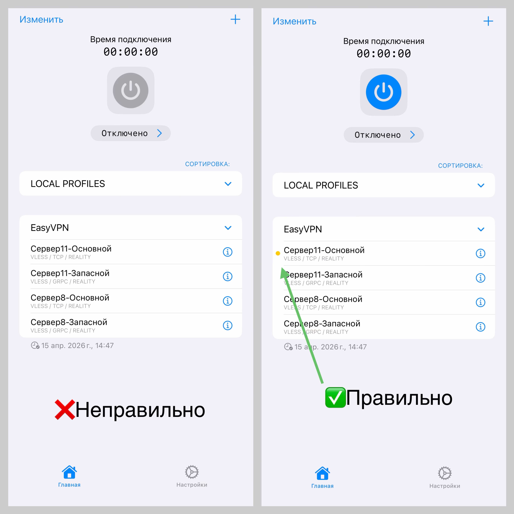
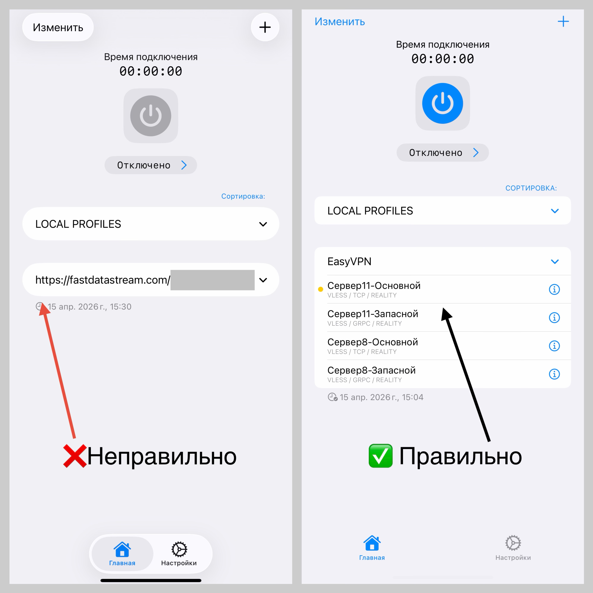

# 🛠 Частые проблемы и решения

Если что-то не работает — не переживайте, это обычно решается за 1–2 минуты 👇

---

## ❌ Кнопка запуска неактивна

**Причина:**  
Не выбран сервер  

**Решение:**  
Нажмите на любой сервер из списка и попробуйте снова  

---

## ❌ Ключ не вставляется / ошибка конфигурации

**Причина 1:**  
Ключ вставлен не полностью или есть старые конфигурации  

**Решение:**  
1. Удалите старые ключи  
2. Скопируйте новый ключ **полностью**
3. Добавьте через "+" → "**Добавить из буфера**"❗️

**Причина 2:**  
Плохое интернет-соединение

**Решение:**  
1. Переключиться между Wi-Fi и мобильным интернетом
2. Для добавления ключа лучше всего использовать  Wi-Fi
3. Проверить, открываются ли обычные сайты

---

## ❌ VPN не работает после подключения

Иногда проблема не в VPN. Попробуйте:

- Выбрать другой сервер  
- Включить и выключить авиарежим
- Проверить качество сети
- Перезагрузить устройство
- Нажмите кнопку обновления (две стрелки) 🔄 напротив надписи "EasyVPN"

---

## 📱 Приложение работает странно или с ошибками

Попробуйте:

- Перезапустить приложение  
- Обновить приложение до последней версии  
- Перезапустить устройство  

---

## ❌ Ничего не помогло

Напишите нам на почту vpneasybot@gmail.com

Пожалуйста, приложите:

- Ваш ID (обязательно). Его вы найдете в боте
- Скриншот приложения или запись экрана вставки ключа
- Краткое описание проблемы

Мы постараемся помочь 🙌  

---

## 🔙 Вернуться к инструкции

👉 [Открыть инструкцию](index.md)
