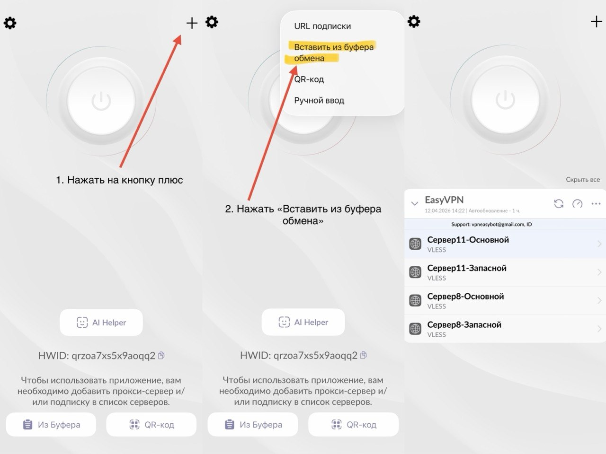
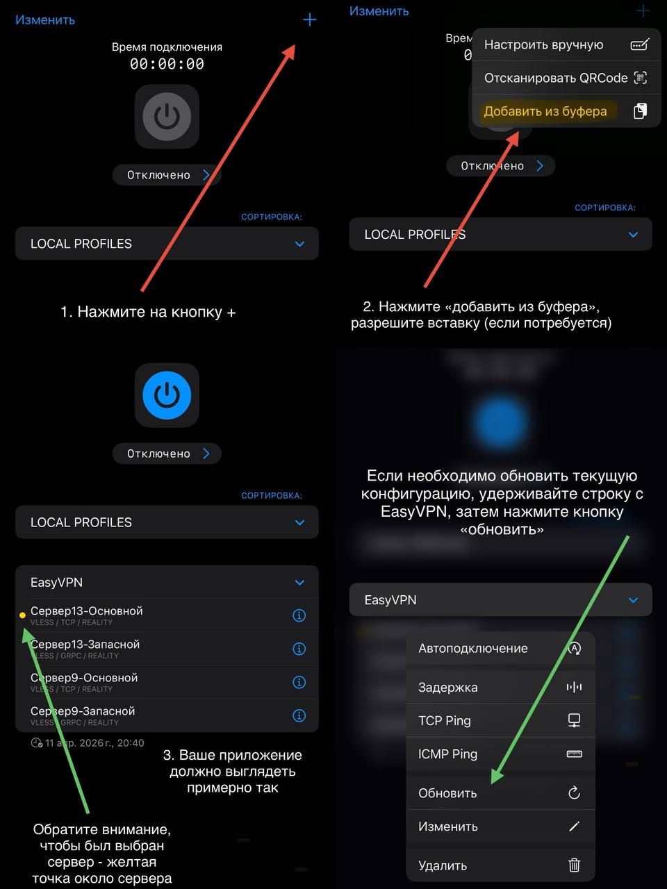
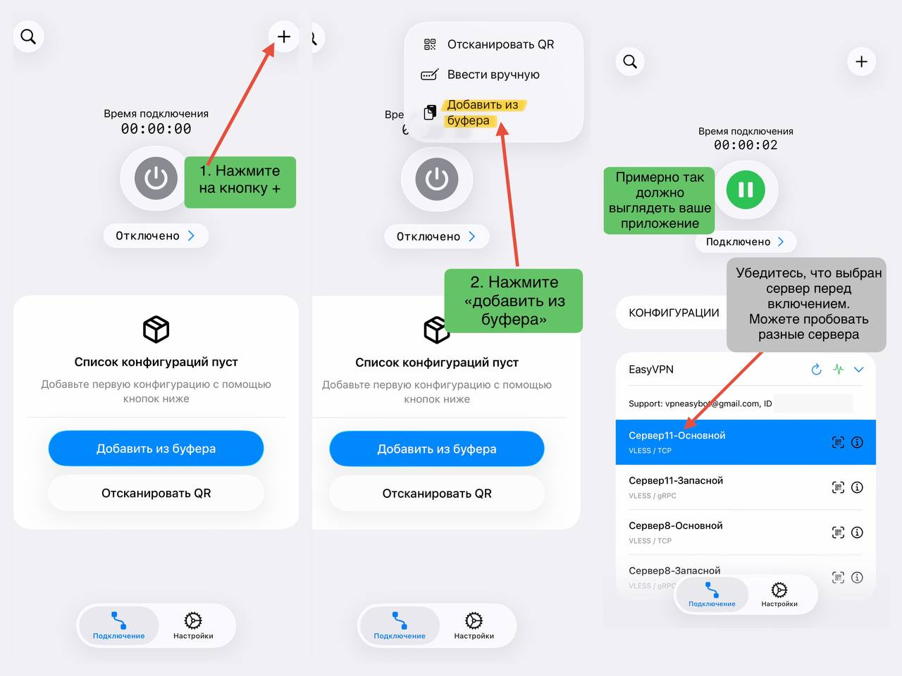
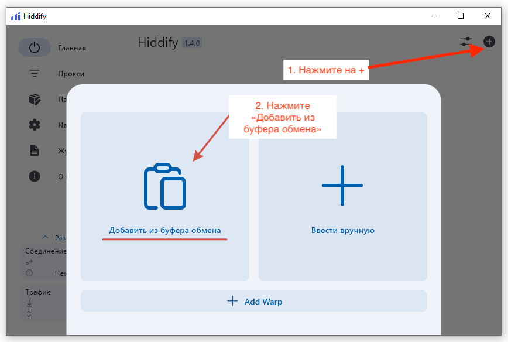

# 🔐 Подключение VPN за 2 минуты

Просто выполните шаги ниже — это проще, чем кажется 👇

---
### Шаг 1 — Установить приложение
Выберите ваше устройство и установите приложение:
- 🍎 iPhone / iPad / Mac → [ссылка](https://apps.apple.com/ru/app/happ-proxy-utility-plus/id6746188973)
- 🤖 Android → [ссылка](https://play.google.com/store/apps/details?id=com.v2raytun.android)
- 💻 Windows → [ссылка](https://github.com/hiddify/hiddify-next/releases/download/v2.0.5/Hiddify-Windows-Setup-x64.exe)

💡 Также вы можете использовать другие приложения, например:
- Streisand
- v2RayTun

### Шаг 2 — Получить ключ
Откройте нашего [бота](https://t.me/vpn_easy_bot) в Telegram, воспользуйтесь командой `/start`, получите ключ, скопируйте его ПОЛНОСТЬЮ.

### Шаг 3 — Добавить ключ
🚨 Важно:

- Перед этим удалите старые ключи
- Ключ должен быть скопирован полностью

Инструкция:

1. Нажмите кнопку "+" в правом верхнем углу
2. Выберите "Добавить из буфера"
3. Вставьте ключ

   ### Happ
   

   ### Streisand
   

   ### v2RayTun
   

   ### Hiddify
   

### Шаг 4 — Подключитесь
1. Выберите любой сервер из списка
2. Нажмите кнопку запуска
   
🎉 Готово 🎉

💡 Если не работает — попробуйте другой сервер

---

## ⚠️ ВАЖНО

Обязательно:

- ##### Удаляйте старые ключи перед добавлением нового
- ##### Всегда выбирайте сервер перед запуском
- ##### Если не работает — попробуйте другой сервер

---

## ❗ Частые проблемы

### ❌ Не подключается
- попробуйте другой интернет (Wi-Fi / мобильный)
- перезапустите приложение  

### ❌ Медленно работает
- смените сервер  
- попробуйте позже  

---

## 📞 Поддержка

Если что-то не получилось — напишите в поддержку:  
👉 @your_support_username
